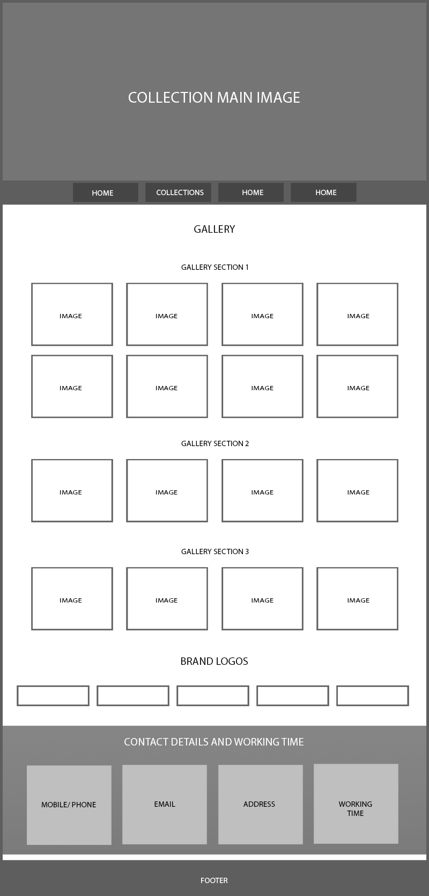

# TILE'S WORLD

Welcome to Tile's World, a traditional Irish company driven by creativity and an endless passion for helping you find the perfect tile for your project. Our goal is to deliver you endless inspiration and the perfect tile pairing for your design project. We can’t wait to work together and make you a part of our family today.

## How to Use

To access our website, simply visit https://ebychacko.github.io/project1_TilesWorld/. From there, you can browse our selection of tiles and find the perfect match for your project. You can also contact us with any questions or feedback you may have.

## Features 
### Overall

it has a unique bright design and the colour scheme is gives a good feel for the users and the design and color scheme is consistent across every page.

The website consists of __4 pages__.

All these pages have overall same design and contains the following features in common.

- Main Image : Each page is loaded with deferent high quality images.
- Navigation bar
- Footer : It contains the copyright details and includes links to the relevant social media sites for Tile's World . The links will open to a new tab to allow easy navigation for the user. 

### Images

There are lots of relevant, high quality images used throughout.

### Navigation bar

After the main image on the center of the page there is a navigation bar with 4 buttons. The 4 buttons are,

- Home
- Collections
- About Us
- Contact

- __Home__

  - Welcome :
  This section contains a brief description about the Tile's World

  - Services : In this section the user can find the main servises provided by the tile's world.
  - Our Brands : This section contais all the mai brands that are associated with the tile's world.
  - Contact: This section provides the user all kinds of contact details including mobile number, mail id and address. I this section inclided the working hours as well.
  - Map : This Section included a map if the customer wants to locate the Tile's World showroom.

- __Collections__

  - This section will allow the user to see the collections available in the Tile's World in the form of images. If the user wants to view the image large, they can just click on the image and the image will open in a deferent tab so that they can view it large.
  - This section will be updated as the collections in the Tile's World changes when the  new collection arrives. 

- __About Us__ 

  - This Section is a gives a brief idea about the tile's World and it's history
  - Our Apecialities : I this section the user can find the main specialities of the tile's world and its team.
  - In this page we included the same our brands section and contact section.

- __Contact__

  - This page will allow the user to get sThe contact details of the Tile's world as well they can send their contact details and some messages to the Tile's world.
  - The user will be asked to submit their full name, mobile number and email address. 

## Wireframes

I used the photoshop 2023 for creating the wireframe for this project.

## Technologies used

### HTML5
* As a structure language.

### CSS
* As a style language.

### Google fonts
* As a font resource.

### GitHub
* As a software hosting platform to keep project in a remote location.

### Photoshop 2023

* As wireframing tool
* As an image editor.

## Testing 

### Functionality testing 

 I used Chrome developer tools throughout the project for testing and solving problems with responsiveness and style issues.

### Compatibility testing
 Site was tested across multiple virtual mobile devices and browsers. I checked all supported devices in Chrome developer tool. 
 
 I tested on hardware devices such as: iphone, macbook, acer laptop etc.

### Validator Testing 

- HTML
  - No errors were returned when passing through the official [W3C validator](https://validator.w3.org/nu/?doc=https%3A%2F%2Febychacko.github.io%2Fproject1_TilesWorld%2F)
- CSS
  - No errors were found when passing through the official [(W3C CSS validator](https://jigsaw.w3.org/css-validator/validator?uri=https%3A%2F%2Febychacko.github.io%2Fproject1_TilesWorld%2F&profile=css3svg&usermedium=all&warning=1&vextwarning=&lang=en)

### Accessability test

I used WAWE web accessibility evaluation tool to check the accessibility of the website. 

[Result](https://wave.webaim.org/report#/https://ebychacko.github.io/project1_TilesWorld/)

### Lighthouse

I used Lighthouse within the Chrome Developer Tools to test the performance, accessibility, best practices and SEO of the website.

#### __Desktop Results__

All pages of the site are achieving a score above 90 across the 4 categories.
- Home Page 

- Collection Page

- About Us Page

- Contact Page

#### __Mobile Results__

All pages of the site are achieving a score above 90 across the 4 categories.
- Home Page 

- Collection Page

- About Us Page

- Contact Page

## Deployment

The project was deployed on GitHub Pages. I used VS Code as a development environment where I commited all changes to git version control system.

I used push command in VS Code to save changes into GitHub.

To deploy a project I had to:

* Log in to GitHub and click on repository to deploy ([project1_TilesWorld](https://github.com/EbyChacko/project1_TilesWorld.git))
* select `Settings` and find GitHub Pages section on the left side bar.
* from source select `Deploy from a branch` and then select `main` branch.
* click `save` and page was deployed after auto-refresh.
>  Site is published at https://ebychacko.github.io/project1_TilesWorld/

## Future Maintainability

To ensure future maintainability of our tiles shop website, we have taken several steps. 
We have used a modular and component-based approach to our code, which makes it easier to update and modify specific parts of the website without affecting the entire codebase. 
We have followed best practices for writing clean and readable code, which makes it easier for future developers to understand and modify the code.
Organised HTML and CSS code into well-defined and commented sections

## Errors

### Fixed Errors

Found a vertical scroll bar on the project progress. Take time to understatnd what is the problem with the code. Finaly I realised that the map-wrapper width 100% makes the vertical scrollbar.

- 

### So I reduced the width to 95%. The problem solved.

- 

### Not Fixed Errors

I used number type input for the mobile number. I found two up and down arrows on the right corner of the input field. If we tap the up arrow it shows a positive value 1 and if we continuesly tap on the up arrow it increase the value by 1 for each tap.
I the same way if tap the down arrow it shows a -1 and if we tap continuesly, it will reduce the value by 1.

I tried to find an input type that accepts the mobile number that have no up and down arrows. I got the `tel` type. But when I used the `tel` type, it can accept the letters from the user. it may cause gather wrong information from the user.

So I decided to stick with the `number` type.

## Credits 

* To complete this project I used Code Institute student template: [gitpod full template](https://github.com/Code-Institute-Org/gitpod-full-template)

### Code

* [Perplexity AI](https://www.perplexity.ai/)
* [chatGPT](https://chat.openai.com/)

### Content:
*  Welcome paragraph & About us :  [celtictiles.ie](https://www.celtictiles.ie/)
*  Welcome paragraph, Our service & About us :  [PAM Tiles](https://pamtilespark.com/)
*  Our specialities :  [Perplexity AI](https://www.perplexity.ai/)

### Map location:
* [coders coffee house](https://bit.ly/2QVfkiy)

### Map:
* [Google maps](https://www.google.com/maps?ll=52.059441,-9.511501&z=16&t=m&hl=en-US&gl=US&mapclient=embed&cid=7306226195280410511)

### Images:

* [unsplash.com](https://unsplash.com/)

* [freepik.com](https://freepik.com/)

* [pixabay.com](https://pixabay.com/)

## Screen Shots

### __Common In every pages__

- Main Image

- Navigation Bar

- Footer

### __Home Page__

- welcome section

- services section

- Our Barnds section

- contact section

- Map

### __Collection Page__

- Gallery section

### __About Us Page__

- About us section

- Specialities section

### __Contact Page__

- Contact Form section
